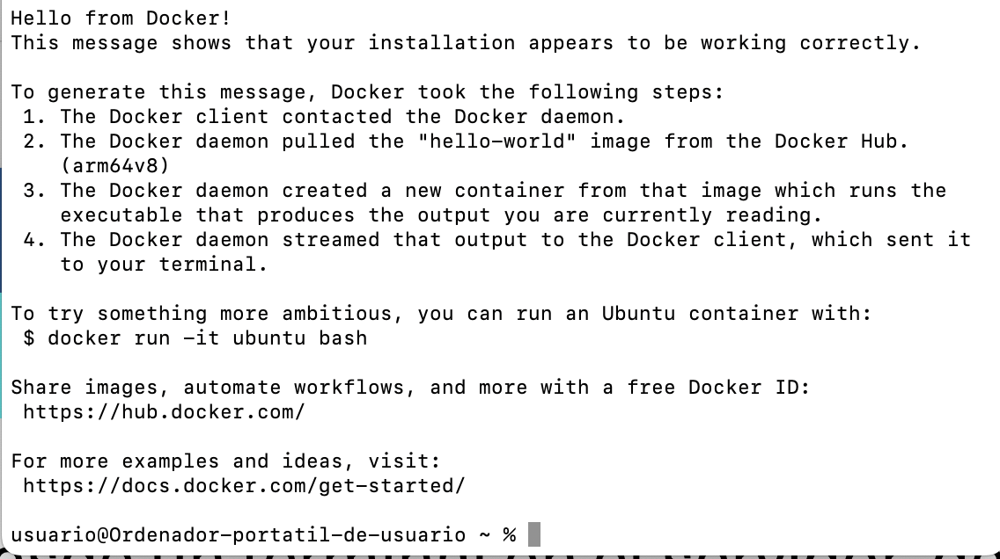
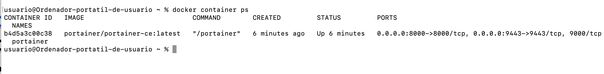

# Instalación del entorno con docker

Podemos instalar docker en cualquier sistema linux, pero en este caso se ha instalado directamente sobre un MacOS Sequoia con procesador M3.

Los pasos seguidos son:

- Descarga de Docker en: https://www.docker.com/
- Instalación del paquete con las opciones por defecto
- Abrimos el terminal y ejecutamos:

```bash
docker container run hello-world
```
Si todo ha ido bien obtenemos:



## Instalación de Portainer

Portainer es una aplicación web que permite gestionar contenedores. Es una interfaz web para **docker-compose**.

```bash
docker run -d -p 8000:8000 -p 9443:9443 --name portainer --restart always -v /var/run/docker.sock:/var/run/docker.sock -v portainer_data:/data portainer/portainer-ce:latest
```
Vamos a ver si se ha ejecutado correctamente:

```bash
docker container ps
```


## Acceso a Portainer

Acceder a Portainer vía web: https://127.0.0.1:9443


Vamos a crear un usuario administrador y proporcionarle una password.
