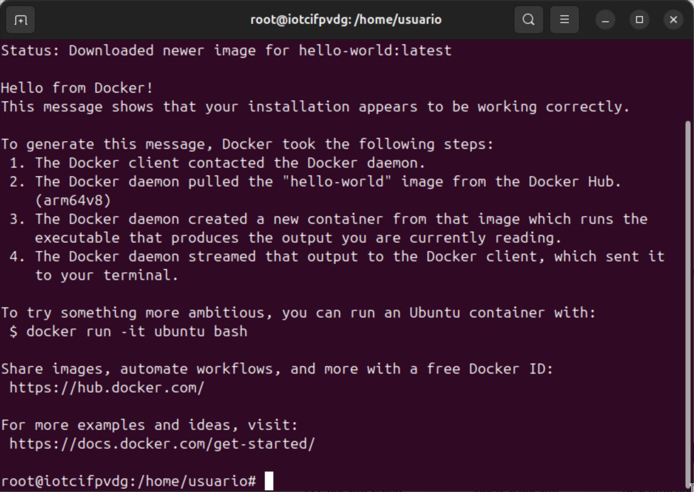
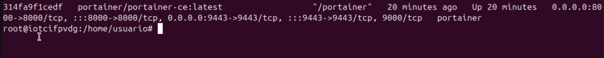
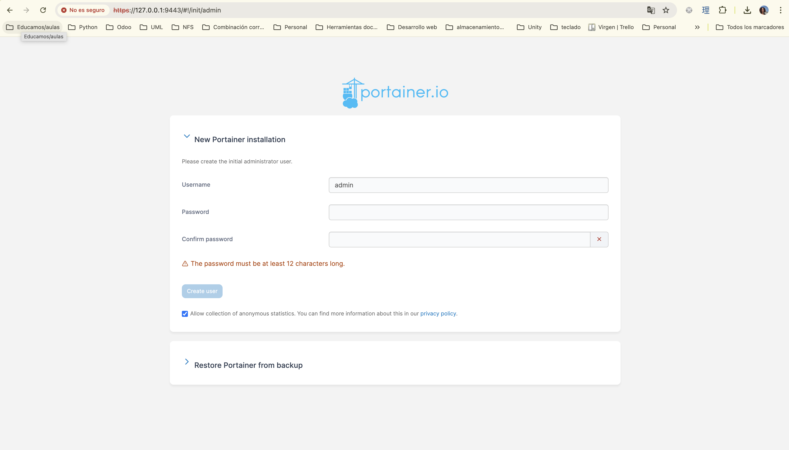
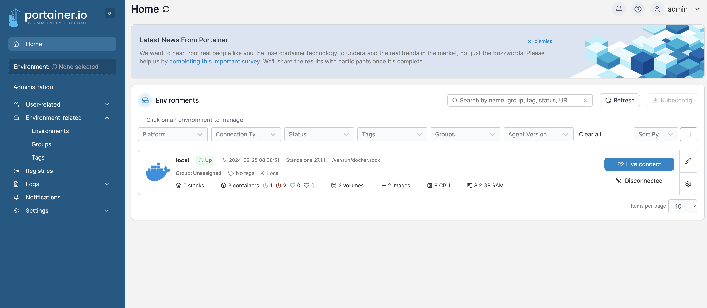
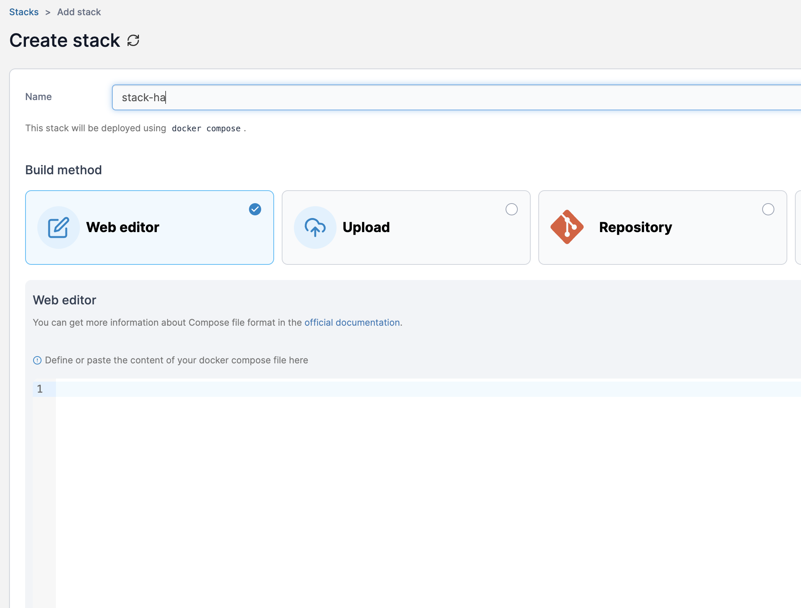
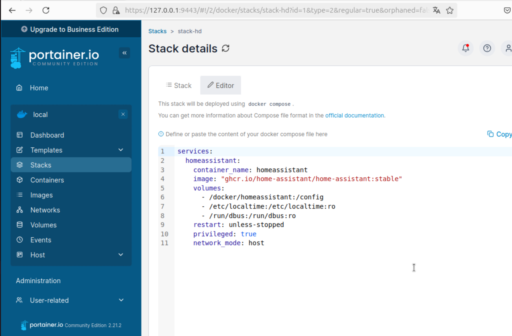
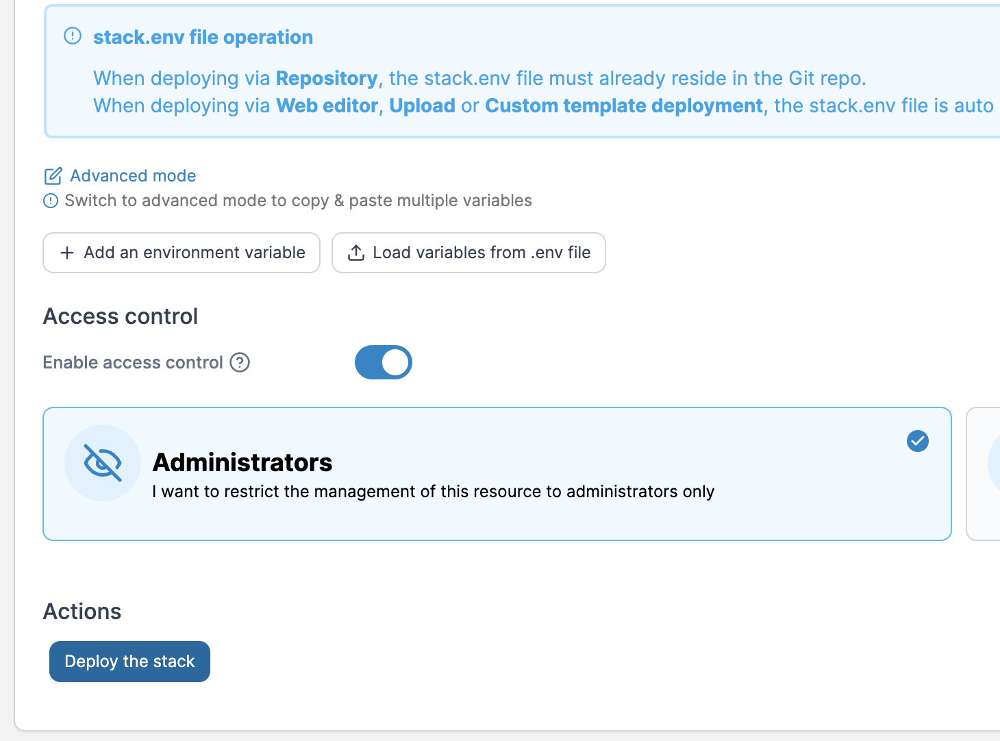
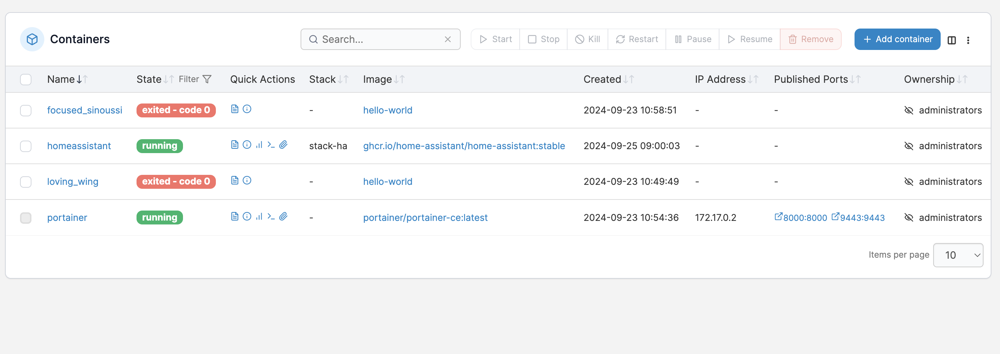
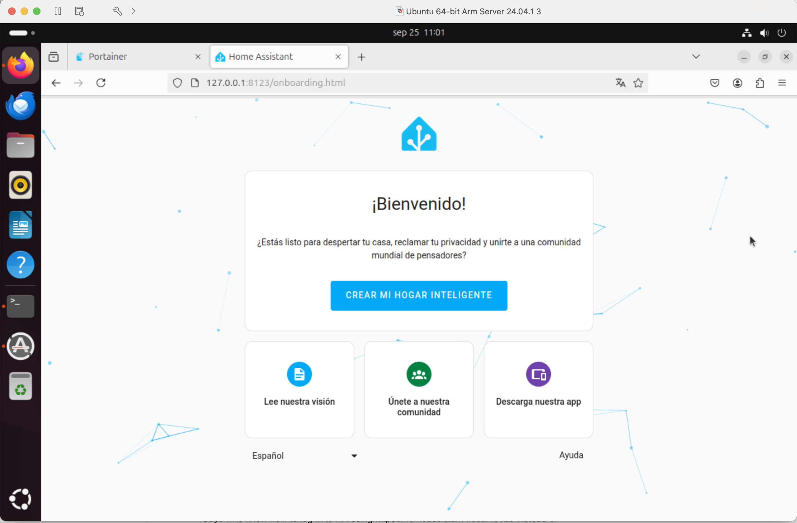

# Instalación del entorno con docker

Podemos instalar docker en cualquier sistema linux, lo vamos a instalar en la máquina virtual instalada previamente.

Para ello he seguido este tutorial: https://www.digitalocean.com/community/tutorials/how-to-install-and-use-docker-on-ubuntu-20-04-es

```bash
sudo apt update
```
```bash
sudo apt install apt-transport-https ca-certificates curl software-properties-common
```
```bash
curl -fsSL https://download.docker.com/linux/ubuntu/gpg | sudo apt-key add -
```
```bash
sudo add-apt-repository "deb [arch=amd64] https://download.docker.com/linux/ubuntu focal stable"
```
```bash
sudo apt update
```
```bash
apt-cache policy docker-ce
```
```bash
sudo apt install docker-ce
```
```bash
sudo systemctl status docker
```

Abrimos el terminal y ejecutamos:

```bash
docker container run hello-world
```
Si todo ha ido bien obtenemos:



## Instalación de Portainer

Portainer es una aplicación web que permite gestionar contenedores. Es una interfaz web para **docker-compose**.

```bash
docker run -d -p 8000:8000 -p 9443:9443 --name portainer --restart always -v /var/run/docker.sock:/var/run/docker.sock -v portainer_data:/data portainer/portainer-ce:latest
```
Vamos a ver si se ha ejecutado correctamente:

```bash
docker container ps
```


## Acceso a Portainer

Acceder a Portainer vía web: https://127.0.0.1:9443
```{warning}
Las capturas de pantalla son de una prueba sobre MacOS pero no fue bien finalmente y hay que hacerlo todo sobre la máquina virtual que tenemos de Ubuntu dentro del MacOS
```



Vamos a crear un usuario administrador y proporcionarle una password.

```{note}
admin/adminAIOT2024
```

Le decimos a Portainer que controle nuestra instalación local de Docker.
**Environment -> Docker -> Live Connect**




## Instalación de Home Assistant

Creamos el directorio `/docker/homeassistant` donde guardaremos la configuración.

```bash
mkdir docker
sudo chown root:docker docker
sudo chmod 774 docker
mkdir docker/homeassistant
```

Creamos un stack en Portainer:
- Accedemos vía web: https://127.0.0.1:9443/
- Stack -> Add Stack -> Ponemos el nombre: `Stack HA`
- Acceder al Stack -> "Stack HA" -> Web Editor



Acceder a http://home-assistant.io/installation/alternative/

Copiamos la sección **docker compose** y la pegamos en el editor del stack `stack-homeassistant.yaml`

Sustituimos `PATH_YOUR_CONFIG` por el path creado anteriormente, en mi caso:


Desplegamos el contenedor: `Deploy the stack`


```{note}
Comprobar que el contenedor Home Assistant se está ejecutando.
```


## Primeros pasos de Home Assistant

- Accedemos a **Home Assistant** desde http://127.0.0.1:8123

