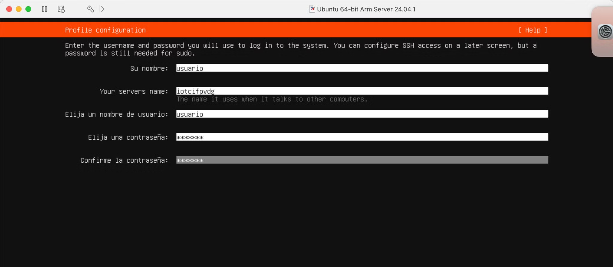
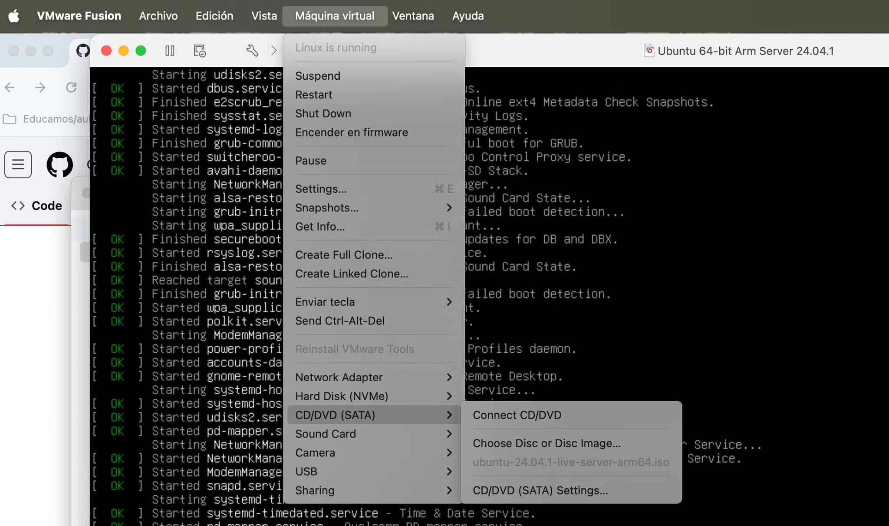
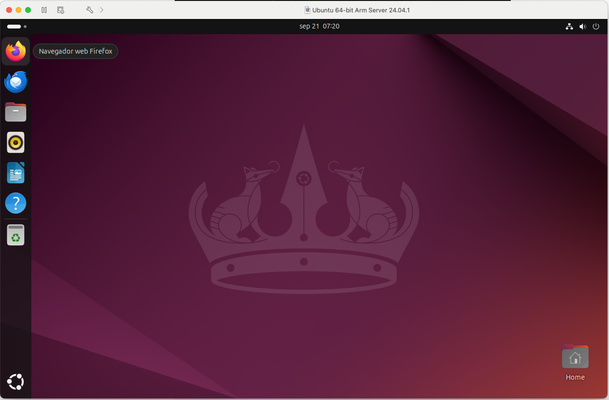

# Instalación de Ubuntu Server con GUI en MACOS con arquitectura ARM (M3)

## Instalación de VMWare Pro Fusion 13 

Instalamos el visor con **Licencia de uso personal** para hacer pruebas.

```{note}
https://support.broadcom.com/group/ecx/productdownloads?subfamily=VMware+Fusion
```

## Instalción Ubuntu Server ARM

Descargamos Ubuntu Server para ARM y posteriormente instalaremos el GUI para tener interfaz gráfica.

```{note}
https://ubuntu.com/download/server/arm
```
Durante la instalación casi todas las opciones serán por defecto, salvo que instalaremos el servidor **OpenSSH**



Para poder reiniciar, debemos expulsar el CD



## Instalación de GUI para Ubuntu Server

```{bash}
sudo apt install ubuntu-desktop
reboot
```



