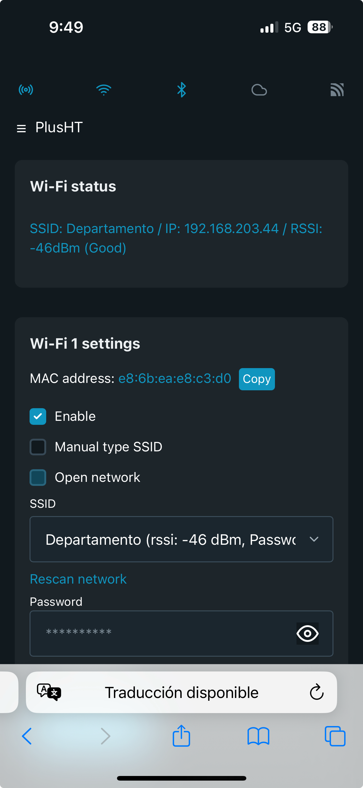
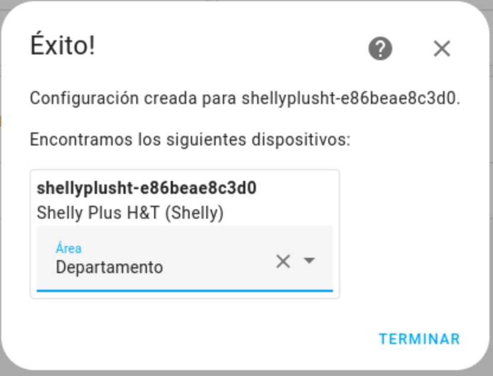
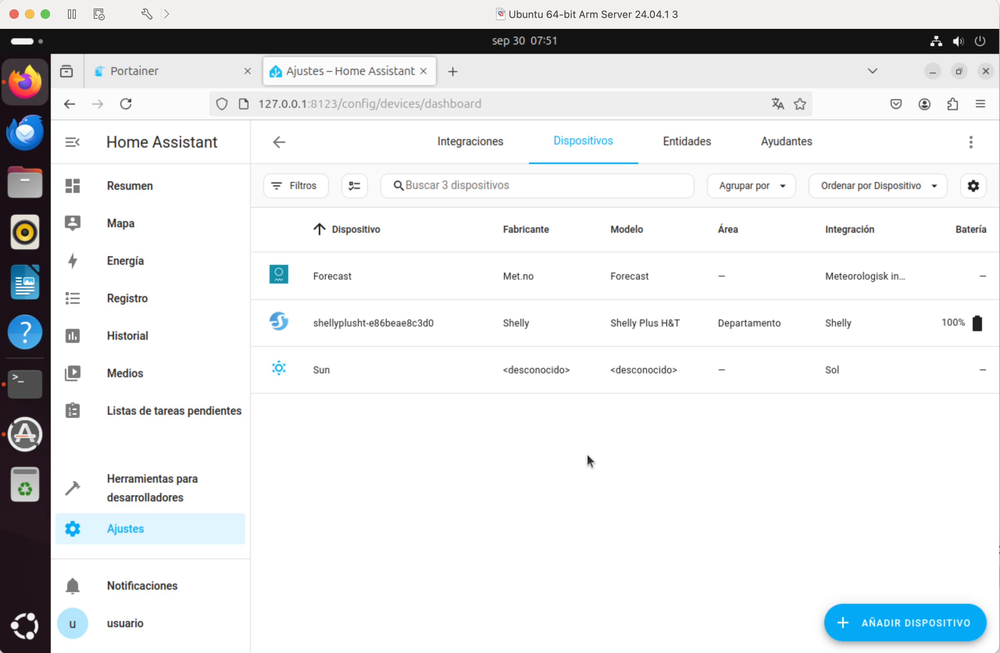
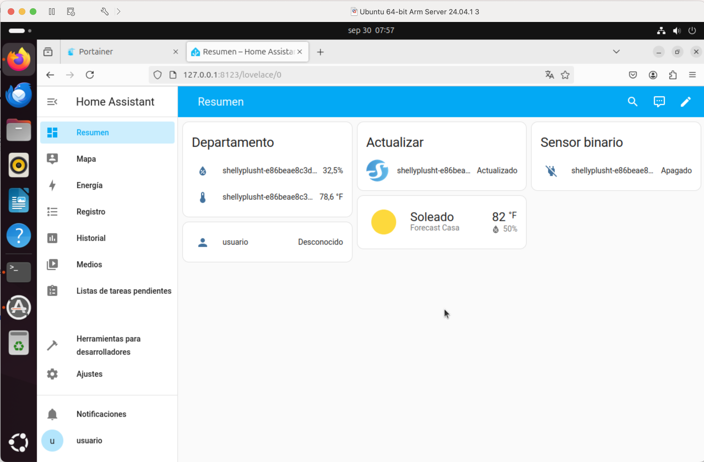
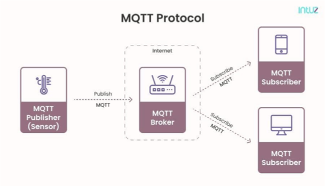
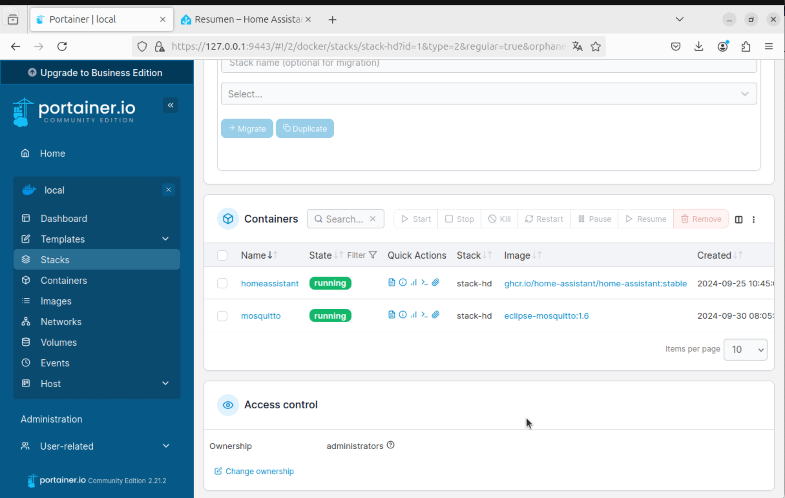
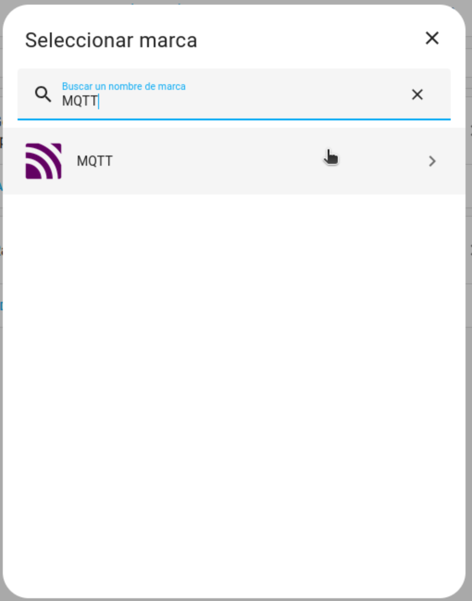
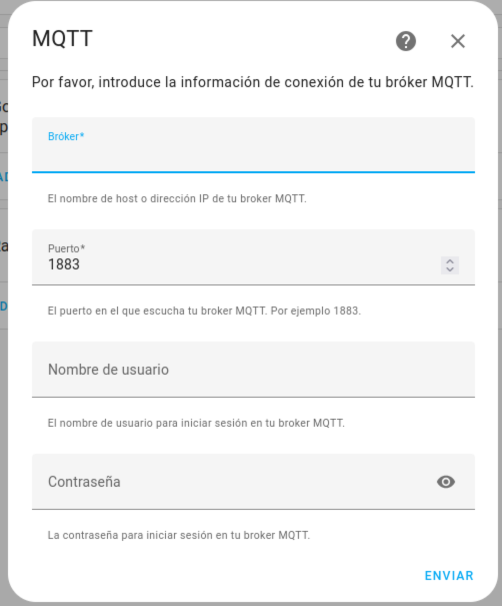

# Integraciones de un sensor (Shelly H&T)

## Integración oficial

- Desde la UI de Home Assistant
  - **Device & Services -> Integrations -> + Integration**
  - Escribir Shelly
  - Escribir la IP del dispositivo y dejar el puerto por defecto 80
  
  - Si HA es capaz de comunicar con el dispositivo, la integración se ha realizado con éxito y el dispositivo se añade a HA.
  
- En **Devices-> Settings** aparecerá el dispositivo y entidades

- En el Dashboard principal (**Overview**) se muestran los valores de las entidades



## Integración usando MQTT (Message Queue Telemetry Transport)


### Instalamos **mosquitto** vía **docker-compose**
- Acceder a **Portainer**: https://127.0.0.1:9443
- Copiamos el fichero `stack-mosquitto.yaml`dentro del stack "Stack HA"
  `stack-mosquitto.yaml`

  ```yaml
    mqtt:
    image: eclipse-mosquitto:1.6
    container_name: mosquitto
    volumes:
      - /docker/mosquitto/config:/mqtt/config
      - /docker/mosquitto/log:/mqtt/log
      - /docker/mosquitto/data:/mqtt/data
    ports:
      - "1883:1883"
      - "8883:8883"
  ```
El stack de HA se quedará:
```yaml
services:
  homeassistant:
    container_name: homeassistant
    image: "ghcr.io/home-assistant/home-assistant:stable"
    volumes:
      - /docker/homeassistant:/config
      - /etc/localtime:/etc/localtime:ro
      - /run/dbus:/run/dbus:ro
    restart: unless-stopped
    privileged: true
    network_mode: host
  mqtt:
    image: eclipse-mosquitto:1.6
    container_name: mosquitto
    volumes:
      - /docker/mosquitto/config:/mqtt/config
      - /docker/mosquitto/log:/mqtt/log
      - /docker/mosquitto/data:/mqtt/data
    ports:
      - "1883:1883"
      - "8883:8883"
```

```{warning}
Vamos a crear un fichero de configuración, para ello debemos tener el contenido del curso descargado de:
**http://github.com/sescolar/cursos.git**
```


- Creamos un fichero de configuración `mosquitto.conf`
```bash
sudo mkdir -p /docker/mosquitto/config
sudo cp CursoHAyLoRA/instalacion/homeassistant/mosquitto.conf /docker/mosquitto/config
```

- Modificamos el stack -> **Deploy Stack**
- Verificar los logs
- Instalar utilidades para publicar/suscribir mensajes MQTT
```bash
sudo apt-get install mosquitto-clients
```
### Vincular MQTT a Home Assistant
- En Home Assistant **Settings->Devices & Services**
- **Integrations -> Add integration -> MQTT**


Necesitamos un brocker MQTT

