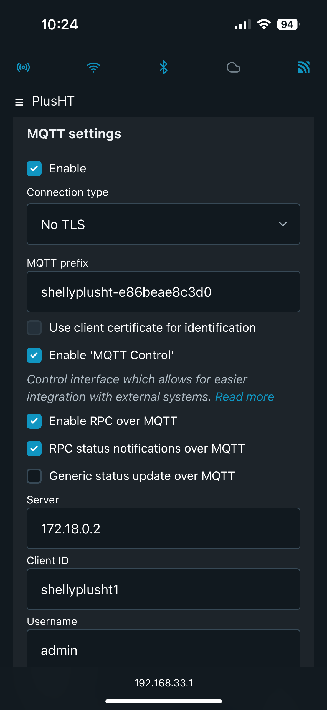
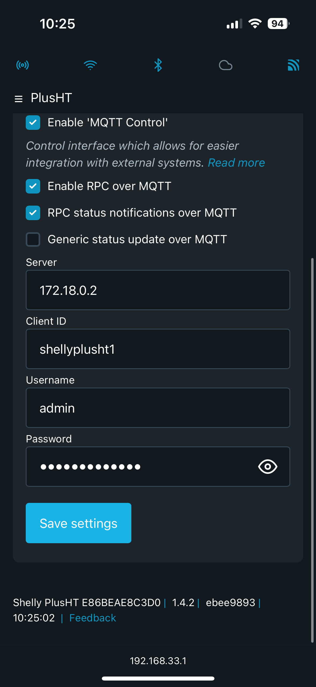

# Configurar Shelly H&T para enviar mensajes MQTT

- Pulsar el botón de `Reset` para activar el modo AP
- Desde otro dispositivo en la red WiFi conéctate al AP
    - Escanear las redes WiFi y conectar al SSID=Shelly-HTGT-<dir MAC>
- Abrir un navegador desde el dispositivo y escribir la URL http://192.168.33.1
- Configurar el cliente MQTT (publisher)
- `Settings -> Connectivity Settings -> MQTT`
    
    `Enable MQTT network`

    `No SSL`

    `MQTT prefix: topic en el mensaje, por ejemplo “shellyh&t1”`
    
    Dirección IP y puerto 1883 del servidor MQTT
    Nombre de usuario y password que escribiste cuando instalaste MQTT (opcional)
    Save Settings




# Obtener un mensaje MQTT del dispositivo Shelly H&T

- Abrir un terminal en el servidor de Home Assistant
- Ejecutar un subscriptor MQTT de cualquier topic “#”

```bash
mosquitto_sub -v -h localhost -p 1883 -t '#'
```

Esperar a recibir un mensaje del dispositivo.

```{warning}
Es muy importante que la máquina virtual esté configurada con el modo **Bridge** para que coja una ip nueva de la red
```
