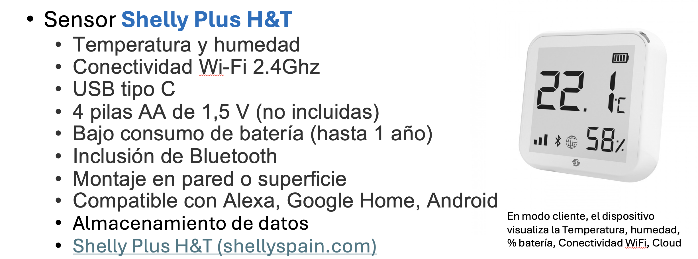
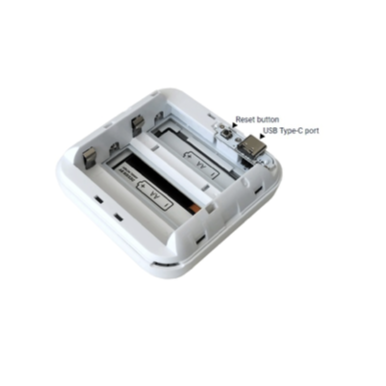
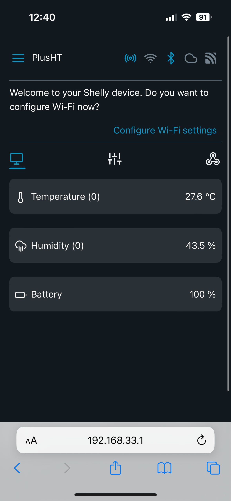
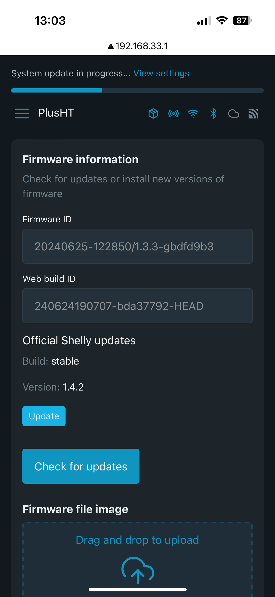
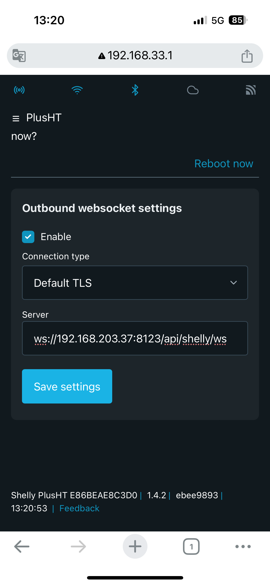

# Prueba Integración de un sensor Shelly H&T
 

## Configuración del sensor
- Abrir la cubierta del dispositivo y colocar las 4 pilas
- Presionar el botón **reset** para poner el dispositivo en modo **AP (Access Point)** 


- Desde otro dispositivo, por ejemplo el móvil, con WIFI: escanear las WIFI y conectar a `SSID=Shelly-HTGT-<dirMAC>`
- Abrir el navegador desde el dispositivo: http://192.168.33.1


  
## Configuración de la WIFI del dispositivo

**Inicio -> Settings -> Network Settings -> WIFI Settings -> WiFi Settings 1**
- Enable WIFI Network
- SSID: Escribir el SSID de la red WIFI del servidor HA y el password
- Save Settings

```{warning}
Al conectarnos a la red WIFI obtendremos una dirección IP por DHCP
```

## Firmware

**Inicio -> Settings -> Firmware**
Actualizar a la última versión.



## Configurar envío de datos a HA

**Inicio -> Settings -> Outbound websocket**

- Enable Outbound Websocket
- URL de acceso al servidor: `ws://<dir_IP_HA>:8123/api/shelly/ws`
- Save settings




